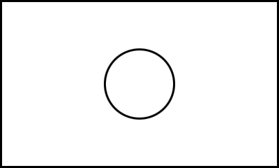

# → Exercises
You can now work on the exercises of chapter 2 yourself. For exercise 2.2.1, you need the figure below.

Download the Jupyter Notebook and go through the different sections.

:::{admonition} Ready to get started?
:class: tip
 
<a href="../exercise_chapter_2.ipynb" download>
Download Chapter 2 exercises →
 
:::

